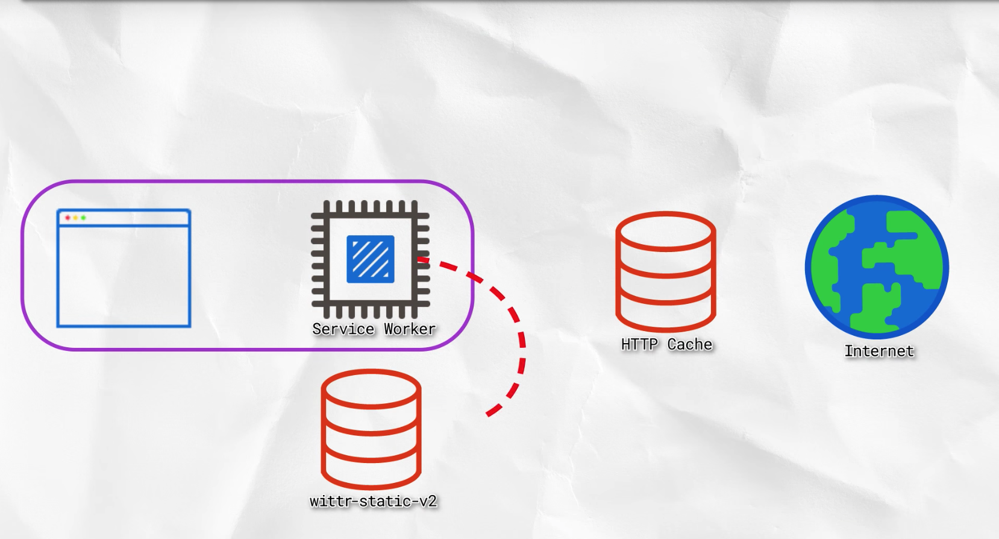
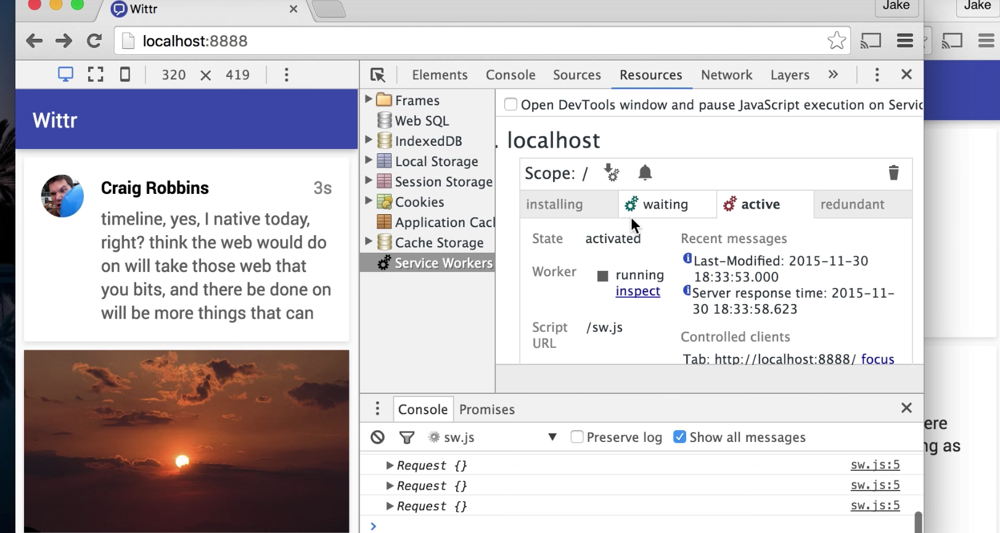
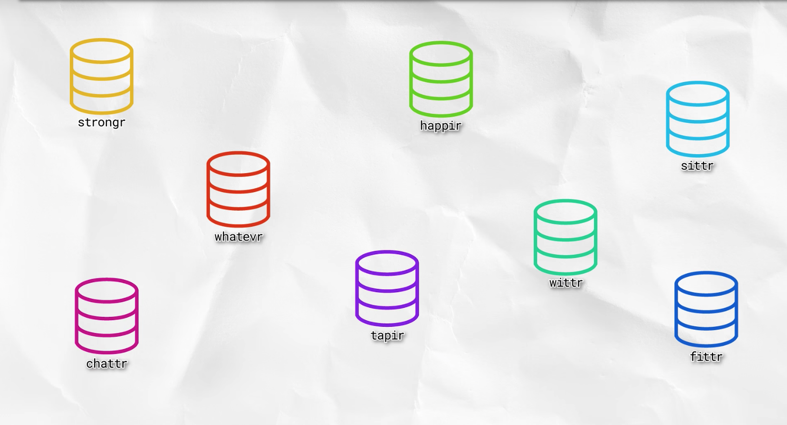

Goal: build sites and apps that work great whatever type of connection the user has.

* Gonna use Service Worker to intercept network traffic
  - 
* Explore the latest Service Worker devtools
  - 
* Gonna use IBDB -- the In-Browser DataBase
  - 
* Explore user experience strategies to deal w/ various network conditions


## Progressive Web Apps
The example used is Wittr, a chat feed app like Twitter. It's an app, but benefits from all
available to a website... To be progressive, it must work without internet connection to some extent. But
this isn't the biggest problem: Lie-Fi.

Lie-Fi is when your phone says you have about 1bar of connectivity, but flickers to zero 
occasionally... It's that 1bar that gives you false hope, and keeps you waiting for a page
to load...when, in truth, it will never load!


There is a lot that goes on between your phone and server an app is hosted on!


The above is only half the journey!  The response has to travel from server all the way back
to the phone.

## Online-First VS Offline-First Web Apps
In an online first approach, one can make an offline mode, e.g., a sad cat pic.  But in this approach,
to determine if the app should display the sad cat pic, it must first assess if there is online
connectivity. This will work fine when there is or is not connectivity, but the app will hang during
times of Lie-Fi. (Example: the app attempts to fetch the page from the network, and if that fails,
the app shows some cached content.)

In an offline first approach, the app is designed with worst case scenarios in mind.  It will work
well offline, in the same way it will work well during Lie-Fi.  The app fires up w/ the assumption
that it's offline, then fills in where it can by connecting to the web. For example, the app 
first delivers the page's header and content from a cache on the device, then attempts to fetch
updated content from the network.

## Install Node
```
brew install node
```


## Clone the Wittr Code
```
git clone https://github.com/jakearchibald/wittr
cd wittr
npm install
```

I got a ton of warnings and scary looking shame-on-you's!  Luckily, the course instructor
said to expect a bunch of this, and to (mostly) not worry about it.


## Run the Wittr App
```
# inside Wittr directory
npm run serve
```


As you can see, the config server is listening on port 8889, while another
server is running at port 8888 (the Jupyter port!).  You can change these ports if/when
necessary.

So, what is the difference in these two servers?  Just plug in 'localhost:888x' into the browser, and
you see that the config server allows you to test for different scenarios (e.g., perfect connectivity,
lie-fi, etc), while the server on 8888 actually serves the app.

(Btw, ctrl+c to exit.)

### Config server (8889)


### App server (8888)


This app starts as a horrible online-first app.  Throughout the course we will work to weed out
the bad parts and, ultimately, create an offline-first, progressive web app.

### Original Wittr Offline Experience


## Some code
This course will use JavaScript ES5, though you can use ES6 if you want.

Websocket!

