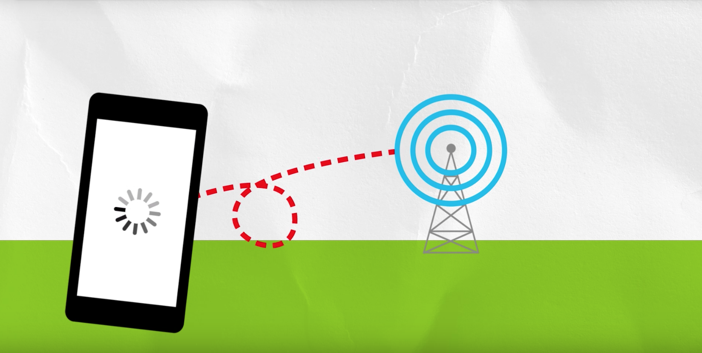
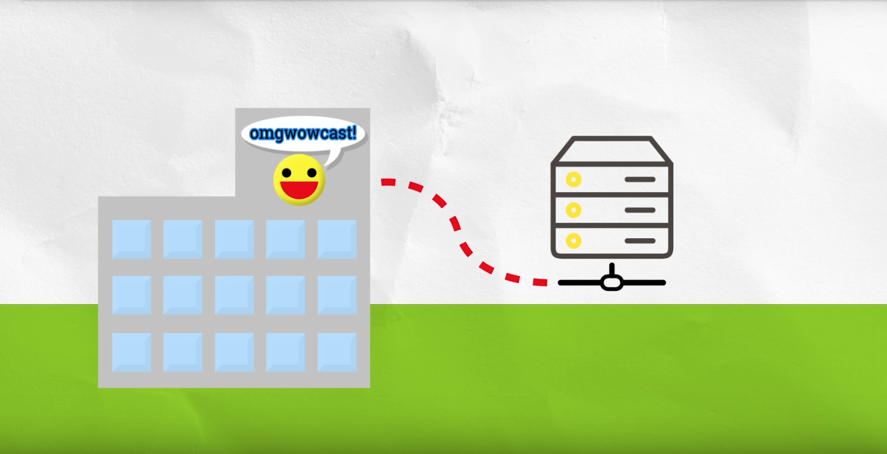
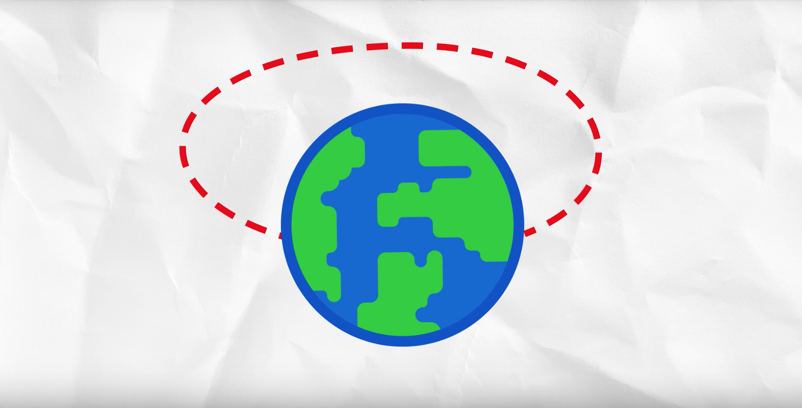
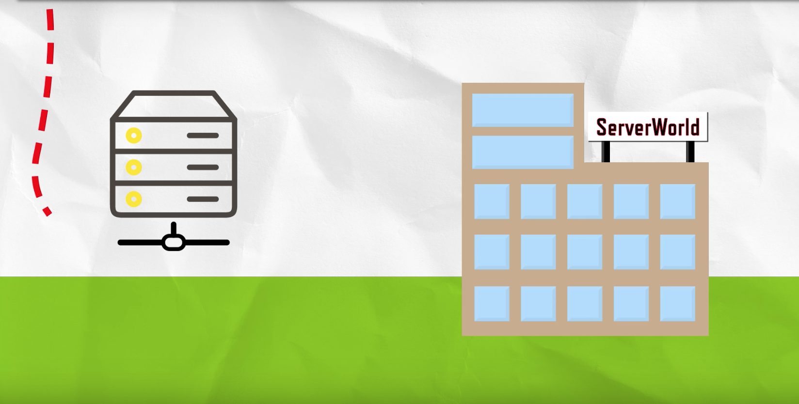

Goal: build sites and apps that work great whatever type of connection the user has.

* Gonna use Service Worker to intercept network traffic
  - 
* Explore the latest Service Worker devtools
  - 
* Gonna use IBDB -- the In-Browser DataBase
  - 
* Explore user experience strategies to deal w/ various network conditions

## Progressive Web Apps
The example used is Wittr, a chat feed app like Twitter. It's an app, but benefits from all
available to a website... To be progressive, it must work without internet connection to some extent. But
this isn't the biggest problem: Lie-Fi.

Lie-Fi is when your phone says you have about 1bar of connectivity, but flickers to zero 
occasionally... It's that 1bar that gives you false hope, and keeps you waiting for a page
to load...when, in truth, it will never load!

There is a lot that goes on between your phone and server an app is hosted on!

